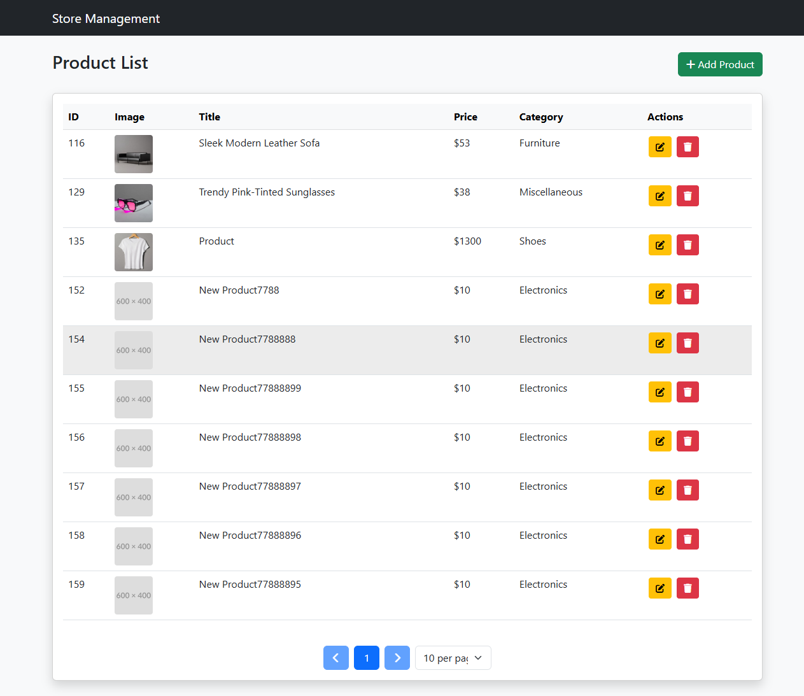

# Store Management Automation with Playwright


This project automates the testing of a Store Management System using Playwright, following the Page Object Model (POM) design pattern. It includes comprehensive test cases for login, product addition, and product updates with detailed reporting.

## Table of Contents

- [Features](#features)
- [Technologies Used](#technologies-used)
- [Project Structure](#project-structure)
- [Test Reports](#test-reports)
- [Screenshots](#screenshots)
- [Setup](#setup)
- [Running Tests](#running-tests)
- [Best Practices](#best-practices)
- [Contributing](#contributing)
- [License](#license)

## Features

- **End-to-End Test Automation**:
  - User login functionality
  - Product management (add, update)
  
- **Comprehensive Reporting**:
  - Extent Reports integration with screenshots
  - Detailed pass/fail logs with timestamps
  - Exception tracking and stack traces
  
- **Cross-Browser Support**:
  - Chrome
  - Firefox
  - WebKit (Safari/IE emulation)
  
- **Data-Driven Testing**:
  - Excel integration for test data (username/password)
  
- **CI/CD Ready**:
  - TestNG framework integration
  - Parameterized test execution

## Technologies Used

- **Playwright**: For reliable browser automation
- **Java**: Primary programming language
- **TestNG**: Test framework with parallel execution support
- **Extent Reports**: For detailed HTML reporting
- **Apache POI**: Excel data handling
- **Page Object Model**: Maintainable test architecture

## Project Structure

Store_Management_Playwright/
├── src/
│ ├── main/
│ │ └── java/
│ │ ├── basedriver/
│ │ │ └── BaseDriver.java # Browser setup and teardown
│ │ ├── pages/
│ │ │ ├── AddProduct.java # Product addition page
│ │ │ ├── LoginPage.java # Login page
│ │ │ └── UpdateProduct.java # Product update page
│ │ └── utilities/
│ │ ├── CommonMethods.java # Shared methods
│ │ ├── ExcelUtils.java # Excel data reader
│ │ └── ExtentFactory.java # Report configuration
│ └── test/
│ └── java/
│ └── tests/
│ ├── LoginTest.java # Login test cases
│ ├── ProductTest.java # Product addition test
│ └── UpdateTest.java # Product update test
├── test-data/
│ └── testdata.xlsx # Test credentials
├── screenshots/ # Auto-generated test evidence
│ ├── create_product_pass.png
│ ├── email_fail.png
│ ├── login_pass.png
│ └── products_page_pass.png
├── reports/ # HTML test reports
│ └── Report.html # Sample report
├── pom.xml # Maven dependencies
└── README.md

## Test Reports

The project generates detailed HTML reports using Extent Reports, including:

- Test execution status (Pass/Fail)
- Timestamps for each action
- Screenshot attachments
- Exception stack traces
- Execution timeline
- Environment details

Sample report highlights:


## Screenshots

Automated screenshots are captured during test execution:

- Success scenarios: 
- Product management: 
- Failure cases: 

## Setup

1. **Prerequisites**:
   - Java JDK 11+
   - Maven 3.6+
   - Node.js (for Playwright installation)

2. **Installation**:
   ```bash
   git clone https://github.com/Mahmuduls1995/Store_Management_Playwright-POM-.git
   cd Store_Management_Playwright
   mvn clean install
