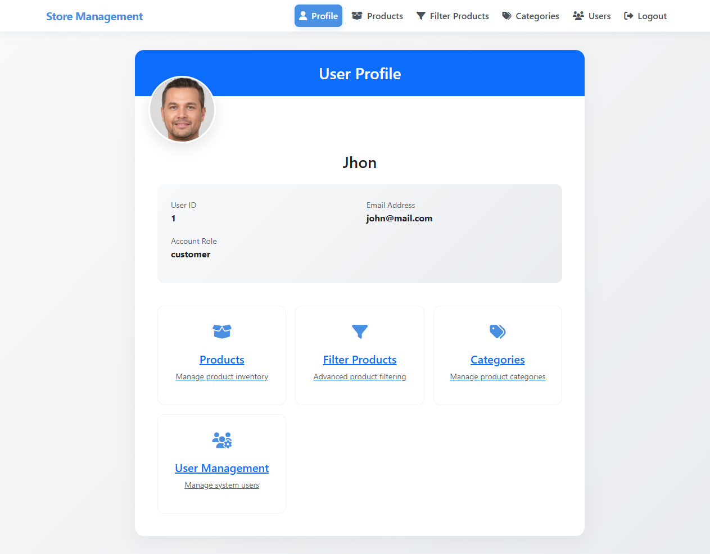

# Store Management Automation with Playwright


This project automates the testing of a Store Management System using Playwright, following the Page Object Model (POM) design pattern. It includes comprehensive test cases for login, product addition, and product updates with detailed reporting.

## Table of Contents

- [Features](#features)
- [Technologies Used](#technologies-used)
- [Project Structure](#project-structure)
- [Test Reports](#test-reports)
- [Screenshots](#screenshots)
- [Setup](#setup)
- [Running Tests](#running-tests)
- [Best Practices](#best-practices)
- [Contributing](#contributing)
- [License](#license)

## Features

- **End-to-End Test Automation**:
  - User login functionality
  - Product management (add, update)
  
- **Comprehensive Reporting**:
  - Extent Reports integration with screenshots
  - Detailed pass/fail logs with timestamps
  - Exception tracking and stack traces
  
- **Cross-Browser Support**:
  - Chrome
  - Firefox
  - WebKit (Safari/IE emulation)
  
- **Data-Driven Testing**:
  - Excel integration for test data (username/password)
  
- **CI/CD Ready**:
  - TestNG framework integration
  - Parameterized test execution

## 🛠 Technologies Used

| Technology      | Purpose                           |
|----------------|-----------------------------------|
| Playwright      | Browser automation               |
| Java            | Main programming language        |
| TestNG          | Testing framework                |
| Extent Reports  | HTML reporting                   |
| Apache POI      | Excel data read/write            |
| Maven           | Build and dependency management  |
| POM Pattern     | Scalable and maintainable tests  |

---


## 📁 Project Structure

```
Store_Management_Playwright/
├── src/
│   ├── main/
│   │   └── java/
│   │       ├── basedriver/
│   │       │   └── BaseDriver.java
│   │       ├── pages/
│   │       │   ├── AddProduct.java
│   │       │   ├── LoginPage.java
│   │       │   └── UpdateProduct.java
│   │       └── utilities/
│   │           ├── CommonMethods.java
│   │           ├── ExcelUtils.java
│   │           └── ExtentFactory.java
│   └── test/
│       └── java/
│           └── tests/
│               ├── LoginTest.java
│               ├── ProductTest.java
│               └── UpdateTest.java
├── test-data/
│   └── testdata.xlsx
├── screenshots/
│   ├── create_product_pass.png
│   ├── email_fail.png
│   ├── login_pass.png
│   └── products_page_pass.png
├── reports/
│   └── Report.html
├── pom.xml
└── README.md
```

## Test Reports

The project generates detailed HTML reports using Extent Reports, including:

- Test execution status (Pass/Fail)
- Timestamps for each action
- Screenshot attachments
- Exception stack traces
- Execution timeline
- Environment details

Sample report highlights:


## Screenshots

Automated screenshots are captured during test execution:

- Success scenarios: 
- Product management: 
- Failure cases: 

## Setup

1. **Prerequisites**:
   - Java JDK 11+
   - Maven 3.6+
   - Node.js (for Playwright installation)

2. **Installation**:
   ```bash
   git clone https://github.com/Mahmuduls1995/Store_Management_Playwright-POM-.git
   cd Store_Management_Playwright
   mvn clean install
## ▶️ Running Tests

You can run tests in several ways depending on your need:

### 🔹 Run All Tests
```bash
mvn test
```
## 🌟 Best Practices

To maintain a clean, scalable, and reliable test framework:

- ✅ Use **Page Object Model (POM)** to separate logic from tests  
- 🔐 Store credentials and test data externally (e.g., in `testdata.xlsx`)  
- 🧪 Use meaningful **assertions** and **logs** for better traceability  
- 📸 Capture screenshots on **both success and failure**  
- 🗂️ Keep folders like `screenshots/` and `test-data/` organized and updated  

---

## 🤝 Contributing

We welcome contributions from the community!

To contribute:

1. 🍴 Fork the repository  
2. 🌿 Create a feature branch  
3. 💾 Commit your changes  
4. 🚀 Open a Pull Request  

Your improvements are greatly appreciated!

---

## 📄 License

This project is licensed under the **MIT License**.  
For more information, see the [LICENSE](LICENSE) file.

---

## 👨‍💻 Developed By

**Mahmudul Hasan**  
📧 Email: [mahmuduls1995@gmail.com](mailto:mahmuduls1995@gmail.com)
